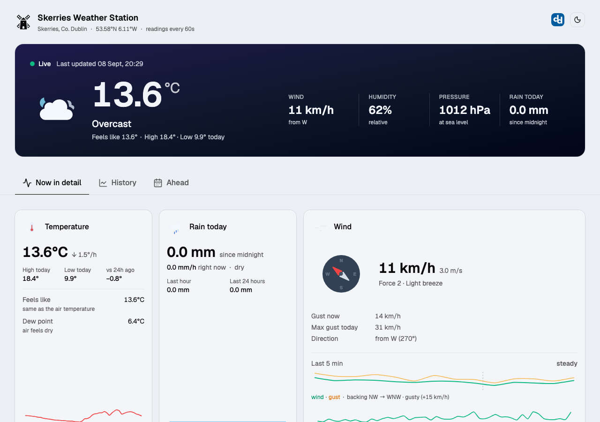
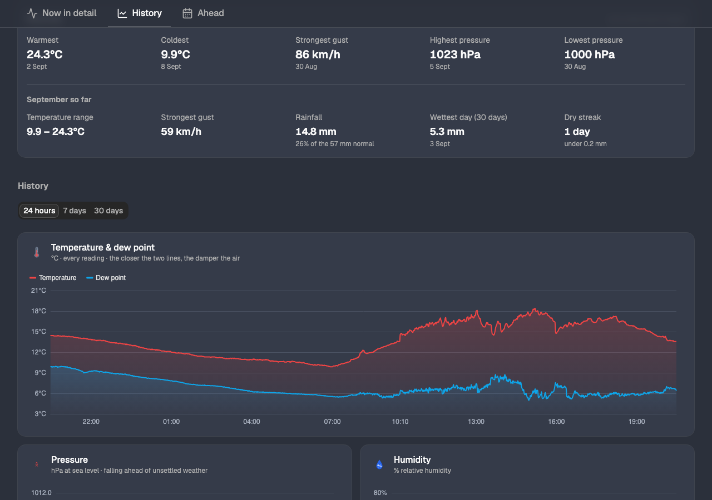
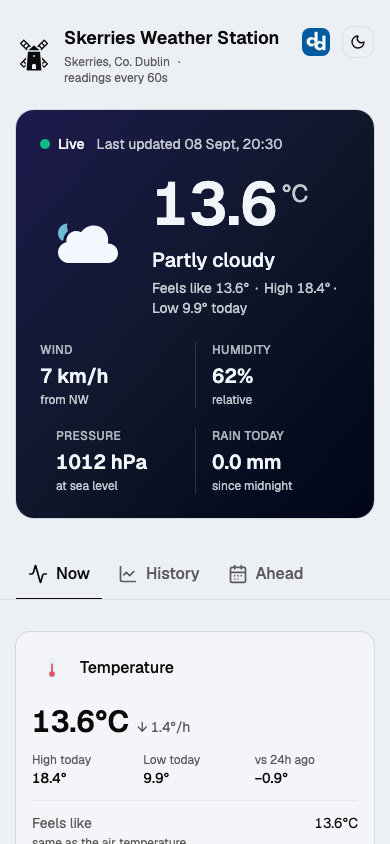

# mipi-weather-station 🌦️

Open-source software for the **Oracle Raspberry Pi Weather Station** kit — a father-son
build in Dublin, Ireland. Rewritten from scratch to replace the (now defunct) official
Oracle/Raspberry Pi Foundation stack.

Live at **[weather.dermotdooley.com](https://weather.dermotdooley.com)** (a dedicated
domain may follow).

## Screenshots

| Dashboard — "Now in detail" | History — 24h / 7d / 30d |
|---|---|
| [](https://weather.dermotdooley.com) | [](https://weather.dermotdooley.com/#history) |

<p align="center">
  
</p>

Real readings from the station in Skerries, Co. Dublin — the hero updates every 45s,
and a new reading reaches the site about 5s after the Pi records it.

## What it does

- Reads the full Oracle kit sensor set on a Raspberry Pi (see
  [docs/sensors.md](docs/sensors.md) for the verified chip-level reference):
  - **BMP085/BMP180 + HTU21D** — temperature, humidity, pressure (I2C)
  - **Anemometer** — wind speed & gust (GPIO pulse counting)
  - **Rain gauge** — tipping bucket (GPIO pulse counting)
  - **Wind vane** — direction (MCP342X ADC over I2C)
- Logs every archive record to a **local SQLite buffer first** (source of truth), so
  nothing is lost during network or power outages — uploaders replay the backlog
  automatically (store-and-forward).
- Pushes readings to a **Supabase (Postgres)** cloud database that powers the website.
- Optionally publishes to **Weather Underground**, **Windy** (Stations API v2),
  **CWOP** (NOAA MADIS), **WOW-BE** (wow.meteo.be) and **WOW / WOW-IE**
  (wow.met.ie) via pluggable uploader modules.
- An **Astro** front end (on Vercel) renders live conditions and history charts.

## Architecture

```
┌─────────────── Raspberry Pi ───────────────┐
│  sensors/ ──▶ core/sampler ──▶ store/      │
│  (BMP085/HTU21D, wind, rain)  (SQLite)     │
│                                  │         │
│                              upload/       │──▶ Supabase (Postgres)
│               (supabase, wunderground,     │──▶ Weather Underground
│                windy, cwop, wowbe, wow)    │──▶ Windy
│                                            │──▶ CWOP / NOAA MADIS (APRS-IS)
│                                            │──▶ WOW-BE (wow.meteo.be)
│                                            │──▶ WOW / WOW-IE (wow.met.ie)
└────────────────────────────────────────────┘
                                                   │
                              Astro site on Vercel ┘
                              (server island: live panel,
                               API route + ECharts: history)
```

## Repo layout

```
pi/     Python collector package (runs on the Pi)
web/    Astro + shadcn/ui site — the full standalone dashboard project
docs/   Wiring, setup, architecture
```

## Quick start (Pi)

```bash
# On the Pi (Raspberry Pi OS, I2C + SPI + 1-Wire enabled via raspi-config)
git clone https://github.com/ddools/mipi-weather-station.git
cd mipi-weather-station/pi
python3 -m venv .venv && source .venv/bin/activate
pip install -e ".[pi]"
cp config.example.yaml config.yaml   # edit pins, station metadata
cp .env.example .env                 # add Supabase / WU / Windy keys
weatherstation                        # run in foreground to test
```

Run on boot:

```bash
sudo cp systemd/weatherstation.service /etc/systemd/system/
sudo systemctl enable --now weatherstation
```

No Pi handy? The collector runs anywhere with **mock sensors**:

```bash
pip install -e ".[dev]"
WS_MOCK_SENSORS=1 weatherstation
```

## Configuration

- `config.yaml` — station metadata (lat/lon/elevation), GPIO pins, calibration
  constants, sample/archive intervals, which uploaders are enabled.
- `.env` — secrets only (Supabase service key, WU station key, Windy password,
  CWOP passcode, WOW-BE auth key, WOW auth key). Never committed; see `.env.example`.

## Roadmap

- [x] Repo scaffold, package structure
- [x] Sensor bring-up & calibration (air sensor → wind → rain → vane)
- [x] SQLite buffer + Supabase uploader (store-and-forward)
- [x] Astro site on Vercel (shadcn/ui): server-island live panel + history charts —
      live at [weather.dermotdooley.com](https://weather.dermotdooley.com)
- [x] Weather Underground upload
- [x] Windy Stations API v2 upload
- [x] Wind rose, gauges, dark mode
- [x] CWOP (APRS) upload — live; id `GW7965` (MADIS `G7965`), registered
      2026-08-31 and activated 2026-09-08 ([docs/cwop.md](docs/cwop.md))
- [x] WOW-BE (wow.meteo.be) upload — code complete; needs a registered site ([docs/wowbe.md](docs/wowbe.md))
- [x] WOW / WOW-IE (wow.met.ie) upload — code complete; needs a site registered at
      wow.metoffice.gov.uk. Note WOW is decommissioning late 2026 ([docs/wow-ie.md](docs/wow-ie.md))

## Licence

MIT — see [LICENSE](LICENSE).
